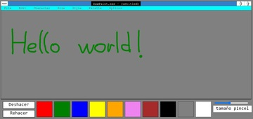

# DDawPaint.exe: Dibujando con canvas

La siguiente imagen es el resultado de **divertirme practicando** lo aprendido en **Desarrollo Web Cliente**:

<picture>
<source media="(min-width: 1366px)" srcset="img/paint_4_x.jpg">
<source media="(min-width: 1280px)" srcset="img/paint_3_l.jpg">
<source media="(min-width: 800px)" srcset="img/paint_2_m.jpg">
<source media="(min-width: 360px)" srcset="img/paint_1_s.jpg">

</picture>

*Hice este programa cuando descubrí el canvas en clase, para practicar, para divertirme y para explorar las posibilidades que ofrece.*

## ¿Qué puedes hacer en el programa?

* Dibujar con distintos tamaños de pinceles.
    - Los tamaños del pincel van desde 1 hasta 19 píxeles.
* Elegir entre 10 colores distintos para divertirte dibujando.
    - En futuras versiones añadiré un color picker.
* Deshacer y Rehacer cuando necesites mejorar los trazos.

## ¿Qué **no** puedes hacer en el programa?

* Cambiar el tipo de pincel, solo puede ser circular.
* Dibujar fuera del área establecida, (*entre "File" y los colores*).

## ¿Cómo lo he hecho?

*Trazando rectángulos...*
1. Primero divido todo en rectángulos y los trazo.
2. Después trazo los detalles.
3. Incluyo los textos.
4. Mediante el método addEventListener defino comportamientos específicos en los distintos elementos del programa, de forma que estos responden a las acciones del usuario.

## ¿Qué elementos son rectángulos y qué elementos no lo son?

|       Son rectángulos        |      No son rectángulos       |
| :--------------------------: | :---------------------------: |
| Guión, flechas y sus sombras | Contenedores y colores (divs) |
|            Textos            |                               |
|        Área de dibujo        |                               |
